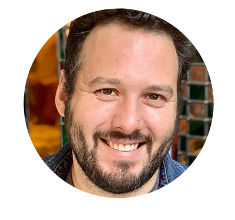

<br>
<br>

<div class = "home-row">
<div class = "home-column-l">

</div>
<div class = "home-column-r">
<h1>Matt Herman</h1>
</div>
</div>

I'm a Data Scientist in the Research Division of the [Council of State Governments Justice Center](https://csgjusticecenter.org/) where I do quantitative analysis and data visualization for criminal justice reform projects. Most recently, I've worked on the Justice Reinvestment Initiative in Minnesota and an analysis of [racial disparities in the Montana criminal justice system](https://csgjusticecenter.org/2021/07/01/racial-disparity-analysis-aims-to-improve-data-collection-in-montanas-justice-system/).

Prior to joining the Justice Center, I was the Deputy Director of the ChildStat Data Unit in the Office of Research and Analytics at the [New York City Administration for Children’s Services](https://www1.nyc.gov/site/acs/about/data-analysis.page) where I worked to improve outcomes for children and families involved in the child welfare system by using data to monitor and evaluate the effectiveness of the agency. During the Covid-19 pandemic, I developed an "Early Alert Dashboard" that tracked week-to-week changes in child protection metrics and was used by senior leadership at the agency.

I like using the [R programming language](https://en.wikipedia.org/wiki/R_(programming_language)). I’m a co-author of the [tidycensus](https://walkerke.github.io/tidycensus/) R package, that makes it easy to download US Census and American Community Survey data using the Census web API. I also built and maintain a [Covid-19 tracking site for Westchester County, NY](https://westchester-covid.mattherman.info/).

Before ACS, I spent five years recording oral histories with ends me [StoryCorps](https://storycorps.org/) and helped to open a butcher shop and salumeria called [Ends Meat](https://www.endsmeatnyc.com/). I received a BA in American Studies from Columbia University in 2006 and an MS in Applied Social Research from Hunter College in 2018.


I live in Katonah, NY with my wife, Jaime, daughters, Maya and Tessie, and cat, Isabella. Get in touch at [mfherman@gmail.com](mailto:mfherman@gmail.com).

```{css, echo=FALSE}
d-title, d-byline {
  display: none
}
```
